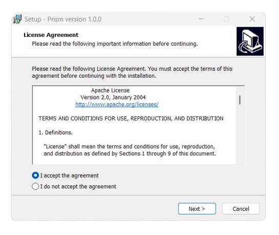

# Prism

**Prism** is an **open-source**, **lightweight**, **super-fast**, and **customizable** code editor built entirely with **Java Swing**. Designed for performance and simplicity, Prism aims to deliver a smooth editing experience for developers who prefer a native desktop editor without the overhead of large frameworks.

[Click here](#installation) to install Prism.

## Features

Prism is packed with powerful features designed for speed and efficiency, helping you write, navigate, and run your code with ease.

Core editing:
- Full syntax highlighting for **C**, **C++**, **Java** and **20+ other languages**
- GPU-accelerated rendering keeps large files fluid on modest hardware
- Line numbers, auto-indent, bracket matching, multi-tab/multi-session workspace
- IntelliSense autocompletion and on-the-fly error diagnostics

Navigation & project management:
- **Tree-view file explorer** with drag-and-drop; open, move or rename without leaving the editor
- **Outline panel** updates in real time; click any symbol to jump to its definition
- **Bookmarks**, **recent-files list** and file switcher put any location one keystroke away
- **Global search** & **replace with regex support** across the entire project

Integrated tooling:
- Embedded **PowerShell** / **Command Prompt** terminal for build scripts, Git commands or rapid prototyping
- Side-by-side diff viewer with syntax-aware change highlighting
- **Configurable command palette** for one-click script execution

## Requirements

- **Operating System**: Windows 7 or newer
- **Architecture**: 64-bit

## Installation

Go to [releases](https://github.com/TayebYassine/NeoPrism/releases/), choose which version you want to download, click on **Assets**, and then click on the installer file (like `Prism_Setup_x64_1.0.0.exe`) to download it. When the download finishes, double-click on it to install Prism.

The **Java Runtime Environment** (**JRE**), SE 25, is bundled within the application's installer. There is no need to worry if you have an outdated Java version or have never installed Java before.

Installation Screenshot

## Development

Want to contribute? Prism is open for collaboration as development continues.

## License

Prism is released under the [Apache License 2.0](./LICENSE.txt)